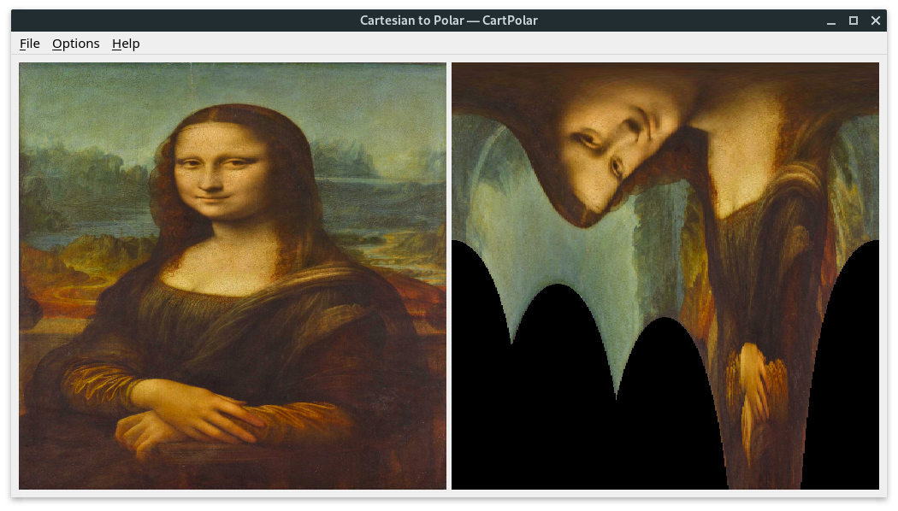

# CartPolar

This program converts images between coordinate systems, with the options of going from Polar to Cartesian or from Cartesian to Polar (in which case the center point is defined by clicking on the image).
